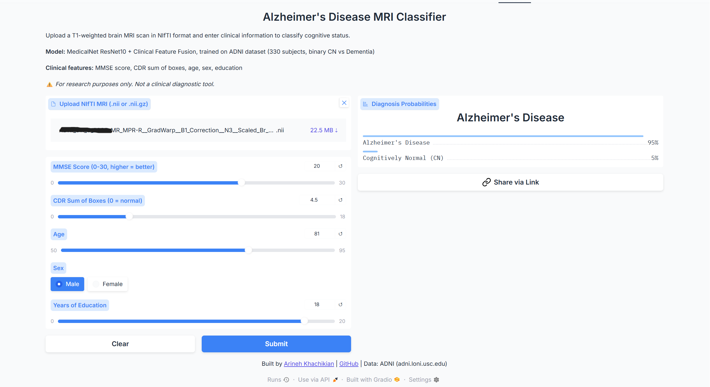

# Alzheimer's Disease MRI Classification

An end-to-end 3D deep learning pipeline for classifying Alzheimer's disease from structural brain MRI, with multimodal fusion of imaging and clinical biomarkers.

**[Live Demo on Hugging Face Spaces](https://huggingface.co/spaces/arinehkhachikian/alzheimer-mri-classification)**  
**[GitHub Repository](https://github.com/ArinehKhachikian/alzheimer-mri-progression)**

---

## Demo



Upload a T1-weighted NIfTI brain MRI alongside clinical measurements (MMSE, CDR, age, sex, education) and get real-time CN vs Dementia classification probabilities.

---

## Results

### Best Model: MedicalNet ResNet10 + Clinical Feature Fusion

| Metric | Value |
|--------|-------|
| Task | Binary CN vs Dementia |
| Test Accuracy | 96.74% |
| AUC-ROC | 0.997 |
| 95% Confidence Interval | [0.935, 1.000] |
| Test Subjects | 92 |

**Per-class performance:**

| Class | Precision | Recall | F1 |
|-------|-----------|--------|----|
| CN | 0.96 | 1.00 | 0.98 |
| Dementia | 1.00 | 0.86 | 0.93 |

---

### Ablation Study — What Drives the Performance?

To understand whether the MRI contributes meaningful signal, I ran a systematic ablation across four experimental conditions:

| Model | Features | AUC-ROC | Notes |
|-------|----------|---------|-------|
| MedicalNet ResNet10 | MRI only (binary) | 0.578 | Imaging alone struggles |
| MedicalNet ResNet10 | MRI only (3-class) | 0.635 | Best imaging-only result |
| MultimodalResNet | MRI + age/sex/education | 0.699 | MRI + demographics |
| Logistic Regression | MMSE + CDR + demographics | 1.000 | Clinical scores alone are near-diagnostic |
| MultimodalResNet | MRI + all clinical features | 0.997 | Full multimodal fusion |

**Key finding:** MMSE and CDR cognitive scores are nearly perfectly diagnostic for CN vs Dementia on their own (AUC 1.0 without MRI). The multimodal model's 0.997 AUC is largely driven by these clinical features. MRI + demographics without cognitive scores achieves AUC 0.699, representing the honest imaging contribution.

This mirrors real clinical practice — clinicians never diagnose Alzheimer's from imaging alone. They combine structural MRI with cognitive assessments and patient history.

---

## The Research Journey

### What I Tried and What Failed

**Attempt 1 — DenseNet121 from scratch (3-class)**
Heavy overfitting — train accuracy reached 97% while val accuracy plateaued at 47%. A 3-class problem (CN/MCI/Dementia) with 325 training subjects is fundamentally underconstrained for a 121-layer model trained from random initialization.

**Attempt 2 — MedicalNet transfer learning (3-class)**
Switching to MedicalNet ResNet10, pretrained on 23 medical imaging datasets, reduced overfitting and improved stability. Test AUC 0.635 — real signal, but MCI remains clinically ambiguous from structural MRI alone.

**Attempt 3 — Binary classification (imaging only)**
Removing MCI simplified the task but test AUC was 0.578 — the model predicted mostly CN and failed to identify Dementia patients without clinical context.

**What worked — Multimodal fusion**
Adding five clinical features (MMSE, CDR, age, sex, education) as a parallel input stream alongside the MRI produced a decisive improvement. The ablation then revealed MMSE and CDR are the primary drivers, motivating the MRI + demographics-only experiment (AUC 0.699) as the rigorous imaging contribution.

---

## Architecture

### Multimodal Fusion Model

```
MRI Volume (1 × 128 × 128 × 128)       Clinical Features (5)
           ↓                                     ↓
  MedicalNet ResNet10               Clinical Encoder
  (pretrained backbone)             Linear(5→32) → ReLU → Linear(32→32)
           ↓                                     ↓
  512-dim image features    +       32-dim clinical features
               ↓ concatenate ↓
           544-dim combined vector
                    ↓
    Classifier: Linear(544→128) → ReLU → Dropout(0.3) → Linear(128→2)
                    ↓
        CN / Dementia probability scores
```

**Clinical features:**
- MMSE (Mini-Mental State Exam, 0–30)
- CDRSB (Clinical Dementia Rating Sum of Boxes)
- Age at baseline
- Sex
- Years of education

---

## Dataset

**Source:** ADNI (Alzheimer's Disease Neuroimaging Initiative) — accessed via approved researcher credentials through UC Santa Barbara

| Property | Detail |
|----------|--------|
| Phase | ADNI1 |
| Total subjects | 559 |
| Binary subset (CN + Dementia) | 330 |
| MRI type | T1-weighted MPRAGE |
| Scanner strength | 1.5 Tesla |
| File format | NIfTI (.nii) |
| Preprocessing | GradWarp, B1 Correction, N3, Scaled |
| Visit | Baseline only |
| Input resolution | 128 × 128 × 128 voxels |

---

## Tech Stack

| Tool | Purpose |
|------|---------|
| Python 3.11 | Core language |
| PyTorch | Deep learning framework |
| MONAI | Medical imaging transforms |
| MedicalNet (Tencent) | Pretrained 3D ResNet weights |
| nibabel | NIfTI loading and RAS orientation standardization |
| scikit-learn | Evaluation metrics, stratified splitting |
| wandb | Experiment tracking |
| Gradio | Interactive demo |
| Hugging Face Spaces | Deployment |
| Kaggle T4 GPU | Cloud training |

---

## Project Structure

```
alzheimer-mri-progression/
├── data/
│   ├── raw/                  # ADNI NIfTI files and clinical CSVs (not committed)
│   └── processed/            # master_labels.csv, train/val/test splits
├── notebooks/
│   ├── 01_eda.ipynb          # Exploratory data analysis and label validation
│   ├── 02_preprocessing.ipynb # Preprocessing pipeline and tensor saving
│   ├── 03_training.ipynb     # Model training on Kaggle GPU
│   └── 04_evaluation.ipynb   # Test set evaluation and metrics
├── src/
│   ├── dataset.py            # PyTorch Dataset classes (ADNI, Tensor, Multimodal)
│   ├── transforms.py         # MONAI preprocessing pipeline
│   ├── model.py              # DenseNet121, MedicalNet, Multimodal architectures
│   ├── train.py              # Training loop with early stopping and wandb
│   └── evaluate.py           # Metrics, AUC, confusion matrix, bootstrap CI
├── outputs/
│   └── figures/              # EDA plots, confusion matrices, demo screenshot
├── app/
│   └── app.py                # Gradio demo (deployed on Hugging Face)
└── requirements.txt
```

**Branches:**
- `main` — 3-class imaging-only pipeline (CN/MCI/Dementia)
- `binary-classification` — binary CN vs Dementia (imaging only)
- `multimodal-dataset` — binary CN vs Dementia with full multimodal fusion ← best results
- `multimodal-no-scores` — binary CN vs Dementia with MRI + demographics only (rigorous ablation)

---

## Limitations

- **Clinical feature leakage:** MMSE and CDR scores are direct measures of cognitive decline — the ablation confirms they drive most of the multimodal model's performance. Future work should explore imaging features that complement rather than replicate cognitive assessments.
- **Dataset size:** 330 binary subjects is small relative to published work. Larger cohorts would improve generalization and enable more robust cross-validation.
- **Val set size:** 50–92 subjects — accuracy metrics shift by 1–2% per subject. Test set results are the authoritative numbers.
- **No Grad-CAM for multimodal model:** Explainability for the fusion architecture is more complex than single-modality and was not implemented in this version.

---

## Background

This project was built independently as a portfolio piece for MS CS/AI applications, building on my undergraduate research in clinical data analysis at the Weimbs PKD Lab at UC Santa Barbara, where I work on propensity score matching and regression analysis for polycystic kidney disease data.

The dual perspective — rigorous statistical analysis and modern deep learning — reflects how I approach clinical AI problems.

---

## Citation

**ADNI:**
> Data used in preparation of this article were obtained from the Alzheimer's Disease Neuroimaging Initiative (ADNI) database (adni.loni.usc.edu). The ADNI was launched in 2003 as a public-private partnership, led by Principal Investigator Michael W. Weiner, MD.

**MedicalNet:**
> Chen, S., Ma, K., & Zheng, Y. (2019). Med3D: Transfer Learning for 3D Medical Image Analysis. arXiv:1904.00625.
